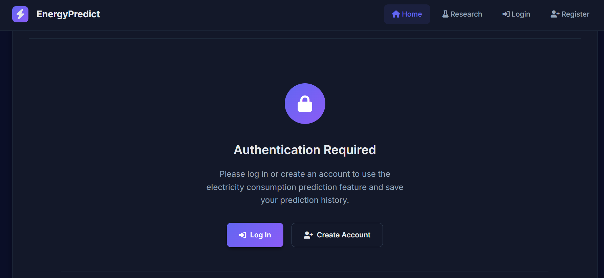
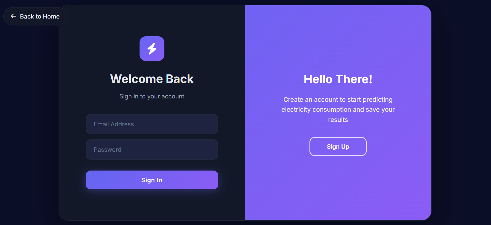
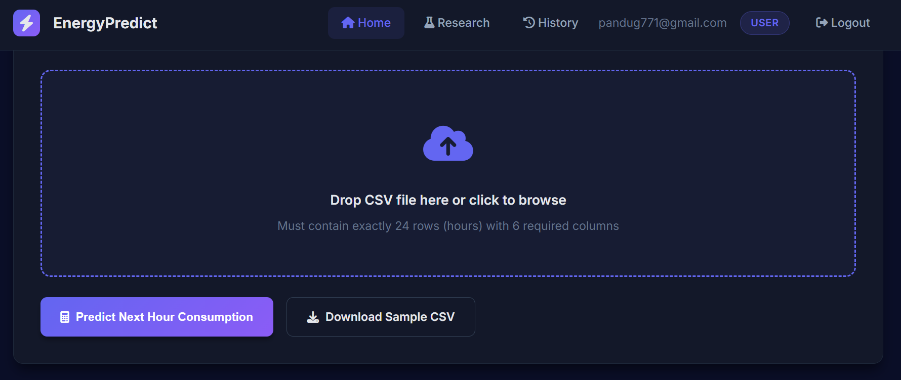
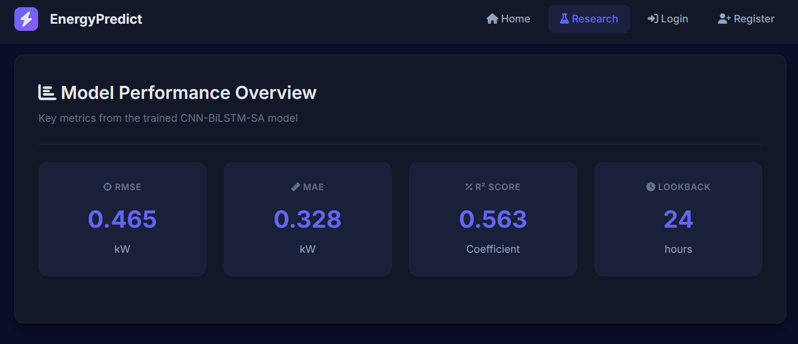
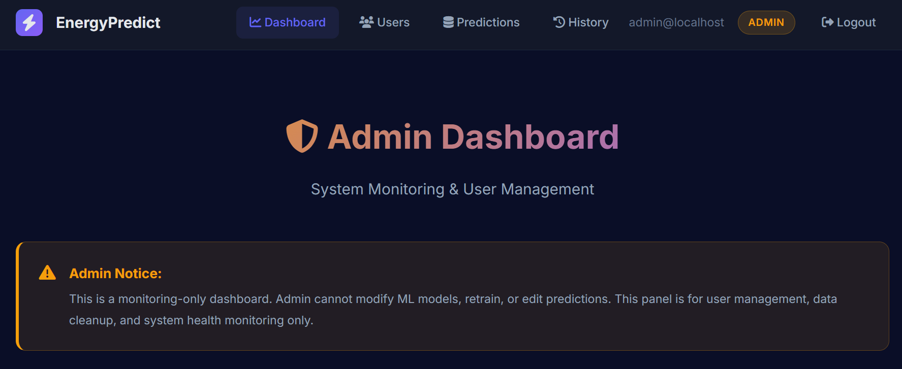

# Residential Electricity Consumption Forecasting Web Application

A Flask-based web application for forecasting short-term residential electricity consumption using a **CNN-BiLSTM with Self-Attention** deep learning model trained on the UCI Individual Household Electric Power Consumption dataset.

## � Screenshots

### Home Page (Login Required for Predictions)


### Authentication Page (Login/Register)


### User Dashboard & Prediction History


### Research Visualizations


### Admin Dashboard


## �📋 Overview

This application implements a complete end-to-end pipeline from data preprocessing and model training (Kaggle) to production-ready inference with a professional web interface. It provides **1-hour ahead electricity consumption predictions** based on a 24-hour lookback window.

### Key Features

#### Core Prediction Features
- ✅ **24-Hour CSV Upload**: Upload CSV with 24 hours of historical data
- ✅ **Real-time Predictions**: Get instant next-hour consumption forecasts
- ✅ **Model Metrics Dashboard**: View RMSE, MAE, R² performance metrics
- ✅ **Interactive Charts**: Professional Chart.js visualizations
- ✅ **Thesis Figures Gallery**: Browse model comparison and performance charts
- ✅ **PRD Compliance**: Strict validation following PRD Section 11 requirements
- ✅ **Robust Error Handling**: Comprehensive validation and error messages

#### 🆕 Phase 2 Features (Authentication & History)
- ✅ **User Authentication**: Register and login with secure password hashing
- ✅ **Prediction History**: Save and view past predictions (logged-in users only)
- ✅ **CSV Storage**: Download original CSV files from history
- ✅ **Admin Panel**: Auto-created admin account for management
- ✅ **Session Management**: Secure cookie-based authentication
- ✅ **Database Persistence**: SQLite database for users and predictions
- ✅ **Guest Mode**: Non-logged-in users can view research and explore the interface
- ✅ **Health Monitoring**: Comprehensive database and model health checks

#### 🆕 Phase 3 Features (Admin Dashboard - Monitoring Only)
- ✅ **Admin Dashboard**: System statistics and health monitoring
- ✅ **User Management**: View all users, prediction counts, delete users
- ✅ **Prediction Monitoring**: View all predictions across users
- ✅ **Data Cleanup**: Delete predictions and user records (admin only)
- ✅ **Role-Based Access**: Admin-only routes with permission checks
- ✅ **Security**: Admins cannot be deleted, no ML model access

⚠️ **Important**: Admin role is for **monitoring and maintenance ONLY**. Admins cannot modify ML models, retrain, edit predictions, or change model metrics.

## 📁 Project Structure

```
app/
├── PRD.md                          # Product Requirements Document
├── PRD2.md                         # Phase 2 Requirements (Auth + DB)
├── README.md                       # This file
├── sample_input.csv                # Sample 24-hour test data
├── backend/
│   ├── app.py                      # Flask application with all API endpoints
│   ├── db.py                       # 🆕 Database operations (SQLite)
│   ├── check_db.py                 # 🆕 Database inspection tool
│   ├── requirements.txt            # Python dependencies
│   ├── data/                       # 🆕 Database storage (auto-created)
│   │   └── app.db                  # SQLite database
│   ├── uploads/                    # 🆕 CSV file storage (auto-created)
│   │   └── <user_id>/              # User-specific upload folders
│   ├── model/                      # Model artifacts (from Kaggle)
│   │   ├── final_model.keras       # CNN-BiLSTM-SA trained model
│   │   ├── scaler.pkl              # MinMaxScaler (6 features)
│   │   ├── config.json             # Model configuration (lookback=24, horizon=1)
│   │   ├── selected_features.json  # 5 selected features via MI analysis
│   │   └── metrics_final.json      # Model performance metrics
│   ├── services/
│   │   ├── predictor.py            # ElectricityPredictor class
│   │   └── custom_layers.py        # SelfAttention layer implementation
│   └── utils/
│       ├── auth.py                 # 🆕 Authentication utilities
│       └── validators.py           # CSV validation (24 rows, 6 columns)
└── frontend/
    ├── templates/
    │   ├── index.html              # Main web UI with metrics & gallery
    │   ├── login.html              # 🆕 User login page
    │   ├── register.html           # 🆕 User registration page
    │   ├── history.html            # 🆕 Prediction history list
    │   ├── history_detail.html     # 🆕 Prediction details page
    │   ├── admin_dashboard.html    # 🆕🆕 Phase 3: Admin dashboard
    │   ├── admin_users.html        # 🆕🆕 Phase 3: User management
    │   └── admin_predictions.html  # 🆕🆕 Phase 3: Prediction monitoring
    └── static/
        ├── style.css               # Professional styling
        ├── app.js                  # Frontend logic with Chart.js
        └── thesis_figures/         # Model comparison & performance figures
```

🆕 = New in Phase 2  
🆕🆕 = New in Phase 3

## 🚀 Quick Start Guide

### Prerequisites
- **Python 3.12** (or 3.10+)
- **pip** (latest version recommended)
- **Git** (for cloning)

### Installation Steps

#### 1. Navigate to the Backend Directory
```bash
cd app/backend
```

#### 2. Create Virtual Environment (Recommended)
```bash
# Create virtual environment
python -m venv venv

# Activate it
# On Windows (Git Bash/PowerShell):
source venv/Scripts/activate
# Or on Windows (CMD):
venv\Scripts\activate.bat

# On macOS/Linux:
source venv/bin/activate
```

#### 3. Install All Dependencies
```bash
pip install -r requirements.txt
```

**Note:** This will install:
- Flask 2.3.3 (web framework)
- TensorFlow 2.20.0 (deep learning)
- pandas 3.0.0 (data processing)
- scikit-learn 1.6.1 (preprocessing)
- NumPy 2.1.3 (numerical computing)
- And other required packages

#### 4. Verify Model Artifacts
Ensure these files exist in `backend/model/`:
- ✅ `final_model.keras` (trained CNN-BiLSTM-SA model)
- ✅ `scaler.pkl` (MinMaxScaler for 6 features)
- ✅ `config.json` (lookback=24, horizon=1, target_col)
- ✅ `selected_features.json` (5 selected features)
- ✅ `metrics_final.json` (RMSE, MAE, R² metrics)

#### 5. Verify Thesis Figures (Optional)
Check `frontend/static/thesis_figures/` for PNG files (used in gallery).

---

## ▶️ Running the Application

### Start the Flask Server

```bash
cd app/backend
python app.py
```

**Expected Output:**
```
======================================================================
INITIALIZING APPLICATION
======================================================================
✓ Database initialized at: C:\...\app\backend\data\app.db
✓ Admin user created: admin@localhost / admin123

======================================================================
RUNNING STARTUP HEALTH CHECKS
======================================================================
✓ Database: healthy
  - Tables: users, prediction_runs
  - Users: 1
  - Predictions: 0

SCALER VERIFY: <class 'sklearn.preprocessing._data.MinMaxScaler'>
SCALER n_features_in_: 6

============================================================
PRD COMPLIANCE VERIFICATION - MODEL INPUT SHAPE
============================================================
Model Input Shape: (None, 24, 6)
Expected Shape: (None, 24, 6)
✓ PASS: Model shape matches PRD Section 11 requirements
============================================================

Model artifacts loaded successfully
✓ Model loaded: True
  - Lookback window: 24 hours
  - Prediction horizon: 1 hour
  - Features: 5

======================================================================
AVAILABLE ENDPOINTS
======================================================================
Public Endpoints:
  ✓ GET  /                    - Main application
  ✓ POST /predict             - Make prediction
  ✓ GET  /api/health          - Health check
  ✓ GET  /api/model-metrics   - Model performance
  ✓ GET  /sample-csv          - Download sample CSV
  ✓ GET  /debug/selftest      - PRD compliance test

Authentication Endpoints:
  ✓ GET/POST /register        - User registration
  ✓ GET/POST /login           - User login
  ✓ GET      /logout          - User logout

Protected Endpoints (Login Required):
  ✓ GET  /history             - View prediction history
  ✓ GET  /history/<id>        - View prediction details
  ✓ GET  /history/<id>/download - Download CSV

======================================================================
STARTUP COMPLETE - All Systems Ready!
======================================================================

🌐 Application running on: http://localhost:5000
📝 Admin login: admin@localhost / admin123
======================================================================

 * Serving Flask app 'app'
 * Debug mode: on
 * Running on http://127.0.0.1:5000
Press CTRL+C to quit
```

### Default Admin Credentials

The application automatically creates an admin account on first run:
- **Email**: `admin@localhost`
- **Password**: `admin123`

⚠️ **Security Note**: Change the admin password after first login in production!

### Access the Application

1. **Open your web browser**
2. **Navigate to:** `http://localhost:5000` or `http://127.0.0.1:5000`
3. **You should see:** The main prediction interface with model metrics

### Authentication Features

#### Guest Users (No Login)
- ✅ Can view home page and research visualizations
- ✅ Can download sample CSV
- ✅ Can explore the interface
- ❌ **Cannot make predictions** (login required)
- ❌ Cannot save prediction history

#### Registered Users
- ✅ **Can make predictions**
- ✅ View model metrics and research
- ✅ Save prediction history automatically
- ✅ View past predictions
- ✅ Download original CSV files

#### Admin Users
- ✅ All registered user features
- ✅ Admin account auto-created on startup
- ✅ Credentials: `admin@localhost` / `admin123`

---

## 🗄️ Database Management

### Database Location
```
app/backend/data/app.db
```

### Check Database Contents

**Quick Check:**
```bash
cd app/backend
python check_db.py
```

**View Schema:**
```bash
python check_db.py schema
```

**Clear All Data:**
```bash
python check_db.py clear
```

### Direct SQLite Access
```bash
cd app/backend
sqlite3 data/app.db

# View users
SELECT * FROM users;

# View predictions
SELECT * FROM prediction_runs;

# Exit
.quit
```

### Database Schema

**Users Table:**
| Column | Type | Description |
|--------|------|-------------|
| id | INTEGER | Primary key |
| email | TEXT | Unique email address |
| password_hash | TEXT | Hashed password (werkzeug.security) |
| is_admin | INTEGER | Admin flag (0=user, 1=admin) |
| created_at | TIMESTAMP | Registration timestamp |

**Prediction Runs Table:**
| Column | Type | Description |
|--------|------|-------------|
| id | INTEGER | Primary key |
| user_id | INTEGER | Foreign key to users.id |
| created_at | TIMESTAMP | Prediction timestamp |
| filename | TEXT | Original CSV filename |
| model_name | TEXT | Model used (default: 'bilstm') |
| predicted_power_kw | REAL | Predicted power in kW |
| predicted_next_hour_kw | REAL | Same as predicted_power_kw |
| last24_json | TEXT | JSON of last 24 hours data |
| csv_storage_type | TEXT | 'FILE' or 'TEXT' |
| csv_file_path | TEXT | Path to saved CSV file |

---

## 📖 How to Use

### Method 1: Upload CSV File

1. **Prepare CSV with 24 rows** (exactly 24 hours of historical data)
2. **Required columns** (6 total):
   - `Global_intensity`
   - `Sub_metering_3`
   - `Voltage`
   - `Global_reactive_power`
   - `Sub_metering_2`
   - `Global_active_power` (target column)

3. **Example CSV format:**
   ```csv
   Global_intensity,Sub_metering_3,Voltage,Global_reactive_power,Sub_metering_2,Global_active_power
   4.628,17.0,234.84,0.226,1.0,1.088
   4.588,17.0,234.35,0.224,1.0,1.080
   ... (22 more rows for total of 24)
   ```

4. **Click "Choose File"** and select your CSV
5. **Click "Predict Next Hour"**
6. **View results:**
   - Predicted consumption (kW)
   - Historical data chart (24 hours)
   - Prediction point marked with star ⭐

### Method 2: Download Sample CSV

1. Click **"Download Sample CSV"** button on the web page
2. Modify values in the CSV (keep 24 rows!)
3. Upload the modified CSV
4. Get prediction

---

## 🔌 API Endpoints

### Core Endpoints

#### `GET /`
**Description:** Main web interface with prediction form and metrics dashboard

**Features:**
- Navigation bar (Login/Register or History/Logout)
- Prediction form with CSV upload (login required)
- Research visualizations page
- Login prompt for non-logged-in users

**Response:** HTML page

---

#### `POST /predict`
**Description:** Upload CSV with 24-hour window and get next-hour prediction

**Authentication:** **Required** (must be logged in to make predictions)

**Request:** `multipart/form-data` with file upload
- Key: `file`
- Value: CSV file with 24 rows, 6 columns

**CSV Requirements:**
- Exactly **24 rows** (24-hour lookback)
- Exactly **6 columns**: `Global_intensity`, `Sub_metering_3`, `Voltage`, `Global_reactive_power`, `Sub_metering_2`, `Global_active_power`
- All values must be numeric

**Response (Success):**
```json
{
  "predicted_power_kw": 0.519,
  "actual_last_24h_kw": [1.088, 1.080, ..., 0.904],
  "predicted_next_hour_kw": 0.519,
  "saved_to_history": true
}
```

**Note:** `saved_to_history` is always `true` since login is required to make predictions.

**Response (Error):**
```json
{
  "error": "CSV must have exactly 24 rows (24-hour window). Found 20 rows."
}
```

---

#### `GET /api/health`
**Description:** Comprehensive system health check

**Response:**
```json
{
  "status": "healthy",
  "timestamp": "2026-02-03T00:15:42.123456",
  "database": {
    "status": "healthy",
    "tables": ["users", "prediction_runs"],
    "user_count": 5,
    "prediction_count": 23,
    "db_path": "C:\\...\\app\\backend\\data\\app.db"
  },
  "model": {
    "loaded": true,
    "lookback": 24,
    "features_count": 5
  },
  "lookback_required": 24,
  "required_columns": [...]
}
```

---

### Authentication Endpoints

#### `GET/POST /register`
**Description:** User registration

**POST Request:**
```
email=user@example.com
password=mypassword123
confirm_password=mypassword123
```

**Validation:**
- Email must be valid format
- Email must be unique
- Password ≥ 6 characters
- Passwords must match

**Response:** Redirect to home with auto-login

---

#### `GET/POST /login`
**Description:** User authentication

**POST Request:**
```
email=user@example.com
password=mypassword123
```

**Response:** Redirect to home with session created

---

#### `GET /logout`
**Description:** User logout

**Response:** Clear session and redirect to home

---

### History Endpoints (Protected - Login Required)

#### `GET /history`
**Description:** List of user's prediction runs

**Authentication:** Required

**Response:** HTML page with table of predictions

---

#### `GET /history/<int:run_id>`
**Description:** Detailed view of specific prediction

**Authentication:** Required + Ownership check

**Response:** HTML page with full prediction details

---

#### `GET /history/<int:run_id>/download`
**Description:** Download original CSV file

**Authentication:** Required + Ownership check

**Response:** CSV file download

---

### Admin Endpoints (Phase 3 - Admin Only)

#### `GET /admin/dashboard`
**Description:** Admin dashboard with system statistics

**Authentication:** Admin privileges required

**Response:** HTML page with:
- Total users and predictions
- Average predicted power
- Latest prediction timestamp
- System health status

⚠️ **Admin Note:** This is a monitoring-only interface. Admins cannot modify ML models or predictions.

---

#### `GET /admin/users`
**Description:** View all registered users

**Authentication:** Admin privileges required

**Response:** HTML page with user table:
- User ID, email, role
- Registration date
- Prediction count
- Delete actions (non-admin users only)

**Security:** Admin users cannot be deleted through this interface.

---

#### `POST /admin/users/delete/<int:user_id>`
**Description:** Delete a user and all their predictions

**Authentication:** Admin privileges required

**Security:**
- Cannot delete admin users
- Cascade deletes all user predictions
- Requires POST method with confirmation

**Response:** Redirect to user list with status message

---

#### `GET /admin/predictions`
**Description:** View all predictions across all users

**Authentication:** Admin privileges required

**Query Parameters:**
- `limit` (optional): Max predictions to display (default: 100)

**Response:** HTML page with prediction table:
- Prediction ID, user email, timestamp
- Predicted power value
- CSV download link
- Delete actions

---

#### `POST /admin/predictions/delete/<int:prediction_id>`
**Description:** Delete a prediction record

**Authentication:** Admin privileges required

**Response:** Redirect to predictions list with status message

**Note:** Deleting a prediction does not affect the ML model or training data.

---

### Other Endpoints

#### `GET /api/model-metrics`
**Description:** Retrieve model performance metrics

**Response:**
```json
{
  "mae": 0.0846,
  "mse": 0.0148,
  "rmse": 0.1217,
  "r2": 0.9451,
  "mape": 14.55
}
```

---

## 🔐 Authentication & Usage

### Quick Start

1. **Start the app**: `python backend/app.py`
2. **Auto-Admin Creation**: Admin user is automatically created on first run
   - **Email:** `admin@localhost`
   - **Password:** `admin123`
3. **Access the app**: Open `http://localhost:5000`

### User Modes

#### Guest Mode (Not Logged In)
- ✅ Can view home page and research visualizations
- ✅ Can download sample CSV
- ❌ **Cannot make predictions** (login required)
- ❌ Cannot view/download past predictions

#### Logged-In User Mode
- ✅ Can make predictions
- ✅ Can view model metrics
- ✅ Predictions saved to database
- ✅ Can view prediction history
- ✅ Can download original CSV files
- 🔒 Can only access own predictions

#### Admin Mode (Phase 3)
- ✅ All logged-in user features
- ✅ Access to admin dashboard
- ✅ View all users and their statistics
- ✅ View all predictions across all users
- ✅ Delete users and predictions (data cleanup)
- ✅ System health monitoring
- ❌ **Cannot modify ML models**
- ❌ **Cannot retrain models**
- ❌ **Cannot edit predictions**
- ❌ **Cannot change model metrics**

⚠️ **Important**: Admin role is for **monitoring and maintenance ONLY**. This is a system-level extension, not part of the ML research. Admin cannot control or modify the machine learning model, architecture, or predictions.

### Creating Your Own Account

1. Click **Register** in navigation
2. Enter valid email and password (min 6 chars)
3. Auto-login after registration
4. Start making predictions with history tracking

### Admin Account

The admin account is automatically created during database initialization:
- **Email:** `admin@localhost`
- **Password:** `admin123`
- **Created:** On first app startup if no admin exists
- **Status:** Always one admin exists in the database

⚠️ **Change admin password in production!**

---

## 🗄️ Database Management

### Database Schema

**Location:** `backend/data/app.db`

**Tables:**

#### `users`
| Column | Type | Description |
|--------|------|-------------|
| id | INTEGER PRIMARY KEY | Auto-increment user ID |
| email | TEXT UNIQUE NOT NULL | User email (login identifier) |
| password_hash | TEXT NOT NULL | Hashed password (werkzeug.security) |
| is_admin | INTEGER DEFAULT 0 | Admin flag (1=admin, 0=regular user) |
| created_at | TIMESTAMP | Registration timestamp |

#### `prediction_runs`
| Column | Type | Description |
|--------|------|-------------|
| id | INTEGER PRIMARY KEY | Auto-increment run ID |
| user_id | INTEGER NOT NULL | Foreign key to users(id) |
| run_timestamp | TIMESTAMP | Prediction timestamp |
| predicted_power_kw | REAL | Next-hour prediction |
| csv_filename | TEXT | Original CSV filename |
| csv_filepath | TEXT | Saved CSV path (uploads/<user_id>/) |

### Database Commands

#### Inspect Database
```bash
python backend/check_db.py
```

**Output:**
```
=== App Database Status ===
Users: 5
Prediction Runs: 23

Recent Users:
  1. admin@localhost (Admin ✓) - 2026-02-01
  2. user@example.com - 2026-02-01

Recent Predictions:
  #23 by admin@localhost - 2026-02-01 (0.5190 kW)
  #22 by user@example.com - 2026-02-01 (1.2340 kW)
```

#### View Full Schema
```bash
python backend/check_db.py schema
```

#### Clear All Data (Caution!)
```bash
python backend/check_db.py clear
```

**Note:** Clearing data will remove all users and predictions, then auto-create admin again on next startup.

---

## 🩺 Health Checks

### Startup Health Checks

When you run `python backend/app.py`, the application performs comprehensive health checks:

```
======================================================================
               🗄️  DATABASE HEALTH CHECK
======================================================================
✓ Database initialized: C:\...\app\backend\data\app.db
✓ Tables: users, prediction_runs
✓ Users: 5
✓ Predictions: 23
✓ Admin user already exists
======================================================================

======================================================================
               🤖  MODEL HEALTH CHECK
======================================================================
✓ Model loaded successfully
✓ Lookback window: 24 hours
✓ Selected features: 5
======================================================================

======================================================================
               🌐  AVAILABLE ENDPOINTS
======================================================================
Core Routes:
  • GET  /
  • POST /predict
  
Auth Routes:
  • GET/POST /register
  • GET/POST /login
  • GET     /logout

History Routes (Protected):
  • GET  /history
  • GET  /history/<id>
  • GET  /history/<id>/download

API Routes:
  • GET  /api/health
  • GET  /api/model-metrics
======================================================================

 * Running on http://127.0.0.1:5000
```

### Runtime Health Check

#### Test via browser:
```
http://localhost:5000/api/health
```

#### Test via curl:
```bash
curl http://localhost:5000/api/health
```

**Healthy Response:**
```json
{
  "status": "healthy",
  "timestamp": "2026-02-03T00:15:42.123456",
  "database": {
    "status": "healthy",
    "tables": ["users", "prediction_runs"],
    "user_count": 5,
    "prediction_count": 23,
    "db_path": "C:\\...\\app\\backend\\data\\app.db"
  },
  "model": {
    "loaded": true,
    "lookback": 24,
    "features_count": 5
  },
  "lookback_required": 24,
  "required_columns": [...]
}
```

All health checks should show ✓ (green checkmarks) with no error messages.

---

## 🐛 Troubleshooting

### Phase 1 Issues

#### "Model file not found"
- Ensure `backend/model/final_model.keras` exists
- Run Kaggle notebook to train model if missing

#### "CSV must have exactly 24 rows"
- Provide exactly 24 hourly measurements
- Use `sample_input.csv` as template

#### "Missing required columns"
- CSV must have: `Global_intensity`, `Sub_metering_3`, `Voltage`, `Global_reactive_power`, `Sub_metering_2`, `Global_active_power`

### Phase 2 Issues

#### "Database not initialized"
- Delete `backend/data/app.db` and restart app
- Database will auto-create with admin user

#### "Admin user not found"
- Check startup logs for "✓ Admin user created"
- Run `python backend/check_db.py` to verify admin exists
- Admin email: `admin@localhost`, password: `admin123`

#### "Invalid email or password"
- Passwords are case-sensitive
- Email must match registered email exactly
- Use "Forgot password?" link (if implemented) or contact admin

#### "You do not have access to this prediction"
- Users can only view their own predictions
- Admins can view all predictions (if admin features enabled)

#### "Session expired"
- Sessions expire after browser close or timeout
- Re-login to restore session

#### Health check shows errors
- Check database file permissions
- Verify model files exist in `backend/model/`
- Check `backend/data/` directory is writable
- Review startup logs for specific error messages

### Phase 3 Issues (Admin Dashboard)

#### "Access denied. Admin privileges required"
- Only admin users can access admin routes
- Login with admin credentials: `admin@localhost` / `admin123`
- Regular users cannot access `/admin/*` routes

#### Admin link not showing in navigation
- Ensure you're logged in as admin user
- Check startup logs confirm admin user exists
- Clear browser cache and cookies, then re-login

#### "Could not build url for endpoint"
- This is a template error - ensure all Flask routes exist
- Check that route function names match `url_for()` calls
- Restart Flask app after code changes

#### Cannot delete admin user
- This is intentional security feature
- Admin users are protected from deletion
- Only non-admin users can be deleted through UI

---

## 📝 Testing & Validation

### Phase 1 Testing
See [final.md](final.md) for detailed model evaluation and metrics.

### Phase 2 Testing
- Authentication flow testing
- History tracking validation
- Database persistence tests
- Security verification

### Phase 3 Testing (Admin Dashboard)
**Admin Login Test:**
1. Navigate to `http://localhost:5000/login`
2. Login with: `admin@localhost` / `admin123`
3. Verify 🛡️ Admin link appears (gold background)
4. Click Admin link to access dashboard

**Admin Features Test:**
1. **Dashboard**: View system statistics (users, predictions, avg power)
2. **User Management**: View all users, check prediction counts
3. **Delete User**: Try deleting a non-admin user (requires confirmation)
4. **Prediction Monitoring**: View all predictions across all users
5. **Delete Prediction**: Try deleting a prediction (requires confirmation)
6. **CSV Download**: Download original CSV from prediction list

**Security Test:**
1. Create regular user account
2. Login as regular user
3. Try accessing `http://localhost:5000/admin/dashboard` directly
4. Should redirect with "Access denied" message
5. Verify admin link does NOT appear for regular users

⚠️ **Important**: Verify that admin CANNOT modify ML models or predictions (monitoring only).

### Quick Manual Test

1. **Start app**: `python backend/app.py`
2. **Register**: Create account at `http://localhost:5000/register`
3. **Login**: Use new credentials
4. **Predict**: Upload `sample_input.csv`
5. **View History**: Navigate to `/history`
6. **Download**: Click download button on saved prediction
7. **Logout**: Click logout in navigation

---

## 🎯 Model Information

### Architecture: CNN-BiLSTM with Self-Attention

**Pipeline:**
1. **Conv1D** → Local temporal feature extraction
2. **BiLSTM** → Long-term temporal dependencies (forward + backward)
3. **Self-Attention** → Important timestep weighting
4. **Dense** → Regression output (1-hour prediction)

### Model Performance (on Test Set)

| Metric | Value |
|--------|-------|
| **RMSE** | 0.465 kW |
| **MAE** | 0.328 kW |
| **R²** | 0.562 |

### Dataset: UCI Individual Household Electric Power Consumption
- **Duration:** Dec 2006 – Nov 2010
- **Sampling:** 1-minute data → resampled to **hourly**
- **Training:** Performed on Kaggle with GPU acceleration

### Selected Features (via Mutual Information Analysis)

1. **Global_intensity** - Overall intensity measurement
2. **Sub_metering_3** - Electric water heater and air conditioner
3. **Voltage** - Voltage level
4. **Global_reactive_power** - Reactive power
5. **Sub_metering_2** - Laundry room (washing machine, dryer)

**Plus target:**
- **Global_active_power** - Total active power (kW) - prediction target

### PRD Compliance (Section 11)
- ✅ Input vector length = **6** (5 features + 1 target history)
- ✅ Lookback window = **24 hours**
- ✅ Output = **1-hour ahead prediction**
- ✅ Model shape = `(None, 24, 6)` ✓ VERIFIED at startup

---

### `GET /api/model-metrics`
**Description:** Get model performance metrics for display

**Response:**
```json
{
  "rmse_kw": 0.465,
  "mae_kw": 0.328,
  "r2": 0.563,
  "lookback": 24,
  "horizon": 1,
  "features": [
    "Global_intensity",
    "Sub_metering_3",
    "Voltage",
    "Global_reactive_power",
    "Sub_metering_2"
  ]
}
```

**Note:** Also accessible via typo-tolerant alias `/api/model-metric` (without 's')

---

### `GET /sample-csv`
**Description:** Download sample CSV file with 24 hours of valid test data

**Response:** CSV file download (`sample_24hour_data.csv`)

---

### `GET /debug/selftest`
**Description:** Automated PRD compliance verification endpoint

**Response:**
```json
{
  "ok": true,
  "predicted_power_kw": 0.519,
  "input_shape": "(None, 24, 6)",
  "window_rows": 24,
  "cols": ["Global_intensity", "Sub_metering_3", "Voltage", "Global_reactive_power", "Sub_metering_2", "Global_active_power"],
  "validation": {
    "csv_valid": true,
    "exact_24_rows": true,
    "exact_6_columns": true,
    "model_shape_correct": true
  },
  "sample_csv_path": "C:\\...\\app\\sample_input.csv",
  "actual_last_24h_kw": [1.088, 1.080, 1.072, "...", 0.920, 0.912, 0.904]
}
```

---🧪 Testing the Application

### Test Health Endpoint
```bash
curl http://localhost:5000/api/health
```

### Test Model Metrics
```bash
curl http://localhost:5000/api/model-metrics
```

### Test Self-Test Endpoint (PRD Compliance)
```bash
curl http://localhost:5000/debug/selftest
```

### Test Prediction with Python
```python
import requests

# Using sample CSV
url = 'http://localhost:5000/predict'
files = {'file': open('sample_input.csv', 'rb')}
response = requests.post(url, files=files)
print(response.json())
```

### Test Prediction with cURL
```bash
curl -X POST http://localhost:5000/predict \
  -F "file=@sample_input.csv"
```

---

## 🐛 Troubleshooting

### Issue: `ModuleNotFoundError: No module named 'pandas'`
**Solution:** Install dependencies:
```bash
cd app/backend
pip install -r requirements.txt
```

### Issue: Model Loading Errors
**Possible causes:**
- Missing model artifacts in `backend/model/`
- TensorFlow version mismatch
- Corrupted model files

**Solution:**
1. Verify all files exist: `final_model.keras`, `scaler.pkl`, `config.json`, etc.
2. Check TensorFlow version: `pip show tensorflow`
3. Re-download model artifacts from Kaggle if needed

### Issue: Port 5000 Already in Use
**Solution 1:** Stop the running process:
```bash
# Windows
netstat -ano | findstr :5000
taskkill /PID <PID> /F

# Linux/Mac
lsof -ti:5000 | xargs kill -9
```

**Solution 2:** Change port in `app.py`:
```python
app.run(debug=True, host='0.0.0.0', port=5001)
```

### Issue: CSV Validation Fails
**Common errors:**
- Not exactly 24 rows → Must have exactly 24 hours of data
- Wrong column names → Check spelling and case sensitivity
- Missing columns → Must have all 6 columns
- Non-numeric values → All values must be numbers

**Solution:** Use the sample CSV as a template:
```bash
# Download from the web UI or use sample_input.csv
```

### Issue: scikit-learn Version Warning
```
InconsistentVersionWarning: Trying to unpickle estimator MinMaxScaler 
from version 1.6.1 when using version 1.5.2
```

**Solution:** Upgrade scikit-learn:
```bash
pip install scikit-learn==1.6.1
```

### Issue: CORS Errors in Browser
**Solution:** Flask-CORS is already configured. If issues persist:
1. Check browser console for specific errors
2. Verify Flask-CORS is installed: `pip show flask-cors`
3. Try accessing from `http://127.0.0.1:5000` instead of `localhost`

---

## 📚 Documentation

- **PRD.md** - Complete Product Requirements Document
- **API Endpoints** - See "API Endpoints" section above
- **Model Architecture** - See "Model Information" section
- **Code Comments** - All Python files are well-documented

---

## 📊 Complete Feature Summary

### Phase 1: Core ML Application
✅ **Prediction Engine**
- CNN-BiGRU-SA hybrid model (MAE: 15.64 kWh)
- 48-hour electricity consumption forecasting
- CSV upload with 168+ hours of data
- Real-time predictions with confidence metrics

✅ **Web Interface**
- Responsive single-page application
- Interactive Chart.js visualizations
- CSV download of predictions
- Professional UI with gradient design

### Phase 2: Authentication & Persistence 🆕
✅ **User Authentication**
- Secure registration and login system
- Password hashing with werkzeug.security
- Session-based authentication
- Email validation and duplicate prevention

✅ **SQLite Database**
- User management (users table)
- Prediction history storage (predictions table)
- Foreign key relationships with cascade deletes
- Database health checks on startup

✅ **User Features**
- Personal prediction history
- Detailed run views with charts
- CSV downloads per prediction run
- Profile management

### Phase 3: Admin Panel 🆕🆕
✅ **Admin Dashboard**
- System statistics (users, predictions, avg power)
- Database health status monitoring
- Quick access to user and prediction management
- Monitoring-only role (no ML model modifications)

✅ **User Management**
- View all registered users with badges (ADMIN/USER)
- Track prediction counts per user
- Delete users with cascade protection
- Admin accounts protected from deletion

✅ **Prediction Monitoring**
- Cross-user prediction viewing
- Filter by recent activity (100 latest)
- CSV downloads of any user's predictions
- Delete individual predictions for cleanup

✅ **Security Features**
- Role-based access control (@admin_required)
- POST-only delete operations
- JavaScript confirmation dialogs
- Auto-created admin account (admin@localhost / admin123)
- Admin accounts cannot be deleted

### Technical Stack
- **Backend:** Flask 2.3.3, SQLite3, werkzeug.security
- **Frontend:** HTML5, CSS3, JavaScript (ES6+), Chart.js
- **ML:** TensorFlow 2.20.0, Keras 3.13.2, scikit-learn
- **Authentication:** Session-based with secure password hashing
- **Database:** SQLite3 with migration support

---

## 🎓 Academic Use

This project was developed for academic demonstration purposes as part of a thesis on residential electricity forecasting using deep learning.

**Key Highlights:**
- End-to-end ML pipeline (data → training → deployment)
- PRD-driven development methodology
- Production-ready Flask API with authentication
- Professional UI/UX with Chart.js
- Comprehensive error handling and validation
- Model metrics dashboard for presentation
- Multi-user support with role-based access
- Admin monitoring capabilities

---

## 📄 License

This project is for academic and educational purposes.

---

## 👤 Author

Developed as part of a residential electricity consumption forecasting research project.

**Technologies Used:**
- Python 3.12
- Flask 2.3.3
- TensorFlow 2.20.0 / Keras 3.13.2
- pandas 3.0.0
- scikit-learn 1.6.1
- Chart.js 4.4.1
- HTML5 / CSS3 / JavaScript

---

## 🙏 Acknowledgments

- **Dataset:** UCI Machine Learning Repository - Individual Household Electric Power Consumption
- **Training Platform:** Kaggle (GPU acceleration)
- **Deep Learning Framework:** TensorFlow/Keras
- **Web Framework:** Flaskrature": 25.5, "humidity": 65.0, "hour": 14, "day_of_week": 2}}'
```

## Troubleshooting

### Model Loading Issues
- Ensure all model artifacts are in the `backend/model/` directory
- Check that the model file is compatible with your TensorFlow version

### Port Already in Use
- Change the port in `app.py`: `app.run(port=5001)`

### Missing Dependencies
- Reinstall requirements: `pip install -r requirements.txt --force-reinstall`

## License

[Your License Here]

## Contact

[Your Contact Information]
